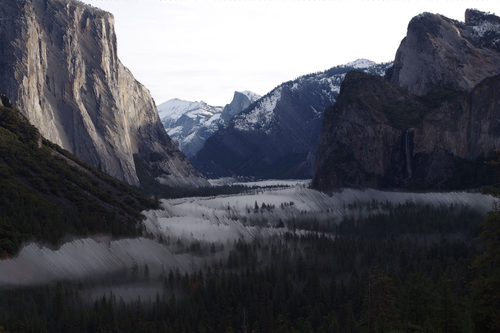

# Pixelsorting

[](https://github.com/ambv/black) [](http://makeapullrequest.com) [](https://github.com/ellerbrock/open-source-badges/) [](https://codeclimate.com/github/wolfembers/Pixelsorting/maintainability) [](https://app.wercker.com/project/byKey/052adc9987159b96aea8885ccef4d9e2)[](https://lgtm.com/projects/g/wolfembers/Pixelsorting/context:python)

[](https://forthebadge.com) [](https://forthebadge.com) [](https://forthebadge.com) [](https://forthebadge.com) [](https://forthebadge.com) [](https://forthebadge.com)

---

## What is Pixel Sorting?

Have a look at [this post](http://satyarth.me/articles/pixel-sorting/) or [/r/pixelsorting](http://www.reddit.com/r/pixelsorting/top/)

All credit goes to [this repo](https://github.com/satyarth/pixelsort) for all the basic parts of this program! This program wouldn't be anything without it.

---

## Dependencies

Requires Pillow. `pip install Pillow` should work. If not, see [here](https://pillow.readthedocs.org/en/3.0.0/installation.html#linux-installation) for details.

Requires requests. `pip install requests`

Requires tqdm. `pip install tqdm`

Requires numpy. `pip install numpy`

There is also a requirements file which pretty much does the same via `pip install -r requirements.txt`.

To instal all at once, run `pip install pillow requests tqdm numpy`

---

## Usage

From the command line:

```
git clone https://github.com/wolfembers/Pixelsorting.git
cd Pixelsorting
python3 pixelsort.py
```

There are presets included. However, if you wish to use any of the "past runs" with your own image, you can use a `preset ID`. The preset ID is created from the date/time when the image was created.
For instance, an image created on `06/18/2019 at 11:38` has the ID of `061820191138`

Most of the images created before 06/10/2019 do NOT have preset ID's.

---

### Starting image MUST be provided in a direct URL. Interval functions, sorting functions, and arguments are parsed after the program runs. No arguments are parsed when the script is called from the command line.

### The output image is provided as a direct image link hosted on put.re or saved locally if the user does not have internet.

---

Tip: To replicate Kim Asendorf's original [processing script](https://github.com/kimasendorf/ASDFPixelSort), first sort vertically and then horizontally in `threshold` (default) mode:

```
python3 pixelsort.py %PathToImage% -a 90
python3 pixelsort.py %PathToSortedImage%
```

---

### Arguments

Parameter 			    | Flag 	| Description
------------------------|-------|------------
Randomness 			    | `-r`	| What percentage of intervals *not* to sort. 0 by default.
Threshold (lower) 	    | `-t`	| How dark must a pixel be to be considered as a 'border' for sorting? Takes values from 0-1. 0.25 by default. Used in `edges` and `threshold` modes.
Threshold (upper) 	    | `-u`	| How bright must a pixel be to be considered as a 'border' for sorting? Takes values from 0-1. 0.8 by default. Used in `threshold` mode.
Char. length		    | `-c`	| Characteristic length for the random width generator. Used in mode `random`.
Angle 				    | `-a`	| Angle at which you're pixel sorting in degrees. `0` (horizontal) by default.

---

### Interval Functions

Interval function 	    | Description
------------------------|------------
`random`			    | Randomly generate intervals. Distribution of widths is linear by default. Interval widths can be scaled using `clength`.
`edges`				    | Performs an edge detection, which is used to define intervals. Tweak threshold with `threshold`.
`threshold`			    | Intervals defined by lightness thresholds; only pixels with a lightness between the upper and lower thresholds are sorted.
`snap`                  | Intervals are sorted by `random` first, then half the pixels are changed to be transparent.
`shuffle-total`         | Intervals are shuffled.
`shuffle-axis`          | Intervals are shuffled across the Y axis.
`waves`				    | Intervals are waves of nearly uniform widths. Control width of waves with `clength`.
`file`				    | Intervals taken from another specified input image. Must be black and white.
`none`				    | Sort whole rows, only stopping at image borders.

---

### Sorting Functions

Sorting function        | Description
------------------------|------------
`lightness`             | Sort by the lightness of a pixel according to a HSV representation.
`hue`                   | Sort by the hue of a pixel according to a HSV representation.
`saturation`            | Sort by the saturation of a pixel according to a HSV representation.
`intensity`             | Sort by the intensity of a pixel, i.e. the sum of all the RGB values.
`minimum`               | Sort on the minimum RGB value of a pixel (either the R, G or B).

---

### Examples (Hover for preset ID)


*[Starting image](https://s.put.re/SRcqAfhP.jpg)*

---


*[Starting image](https://s.put.re/QsUQbC1R.jpg)*

---


*[Starting image](https://s.put.re/567w8wpK.jpg)*

---


*[Starting image](https://s.put.re/567w8wpK.jpg)*

---


*[Staring image](https://s.put.re/Ds9KV8jX.jpg)*

---

### todo

* Allow defining different intervals for different channels.
